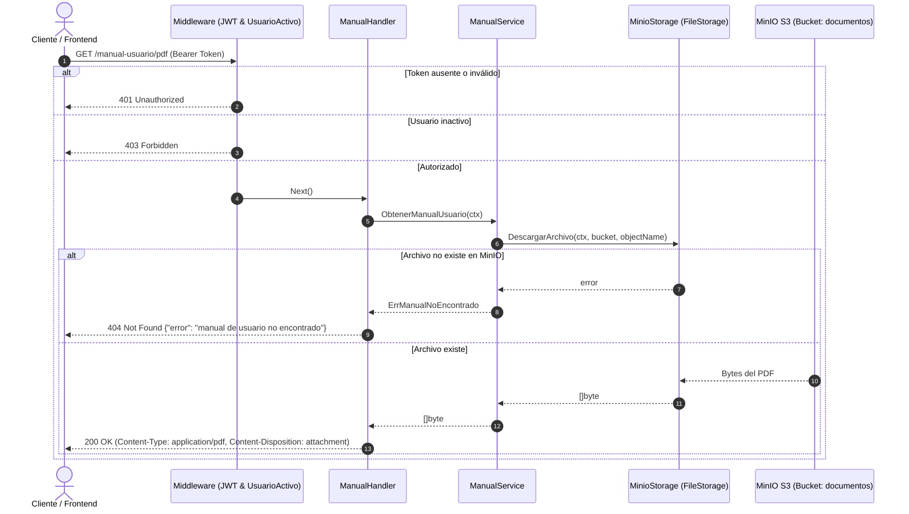

# Informe Técnico de Desarrollo y QA: Descarga de Manual de Usuario

**Proyecto:** StemHub Backend  
**Historia de Usuario:** HU-AYS-B2 (Descarga de Manual de Usuario)  
**Fecha:** Octubre 2026  
**Estado:** Finalizado y Validado  

---

## 1. Resumen Ejecutivo

El presente documento detalla la implementación y pruebas de calidad (QA) del endpoint de descarga del **Manual de Usuario** (`HU-AYS-B2`).

Permite a cualquier usuario autenticado y activo descargar el manual oficial del sistema en formato PDF desde el navegador web o cliente HTTP.

---

## 2. Arquitectura y Componentes Implementados

El flujo de control sigue el patrón arquitectónico por capas del proyecto:

### Detalle de Capas y Archivos

1. **Capa Storage (`FileStorage`):**
   * **Archivos:** `internal/storage/minio_storage.go` y `internal/storage/minio_client.go`
   * Define la interfaz `FileStorage` con `DescargarArchivo(ctx, bucket, objectName) ([]byte, error)`.
   * Implementada en `minioAudioStorage` utilizando el cliente oficial de MinIO (`GetObject`, `Stat` e `io.ReadAll`).

2. **Capa de Servicio (`ManualService`):**
   * **Archivo:** `internal/service/manual_service.go`
   * Método: `ObtenerManualUsuario(ctx context.Context) ([]byte, error)`.
   * Parametriza nombre del bucket y objeto (por defecto `"documentos"` y `"manual-usuario.pdf"`, configurables vía variables de entorno).

3. **Capa de Controladores (`ManualHandler`):**
   * **Archivo:** `internal/handler/manual_handler.go`
   * Manejador Gin `DescargarManual(c *gin.Context)`:
     * Si el archivo no existe: responde `404 Not Found` con `{"error": "manual de usuario no encontrado"}`.
     * Si se recupera con éxito: añade cabecera `Content-Disposition: attachment; filename="manual-usuario.pdf"` y responde `200 OK` con tipo MIME `application/pdf`.

4. **Ruteo y Seguridad:**
   * **Archivo:** `internal/router/router.go`
   * Rutas registradas:
     * `GET /manual-usuario/pdf`
     * `GET /api/manual-usuario/pdf` (alias retrocompatible)
   * Ambas protegidas por `authMiddleware.ValidarJWT` y `authMiddleware.UsuarioActivo`.

---

## 3. Matriz de Cumplimiento de Criterios de Aceptación (HU-AYS-B2)

| Requisito / Criterio | Especificación de la HU | Resultado Implementado | Estado |
| :--- | :--- | :--- | :---: |
| **Precondición 1** | Usuario autorizado | Protegido con `ValidarJWT` y `UsuarioActivo`. Retorna `401 Unauthorized` si no hay sesión o token inválido, y `403 Forbidden` si está inactivo. | **CUMPLIDO** |
| **Precondición 2** | Manual cargado en el sistema | Si el objeto o bucket no existe en MinIO, responde `404 Not Found`. | **CUMPLIDO** |
| **Criterio 1** | Petición al endpoint devuelve HTTP 200 y el manual de usuario | `GET /manual-usuario/pdf` retorna `200 OK`, `application/pdf` y cabecera de descarga (`attachment; filename="manual-usuario.pdf"`). | **CUMPLIDO** |
| **Criterio 2** | Archivo inexistente responde HTTP 404 | Retorna `404 Not Found` con mensaje `{"error": "manual de usuario no encontrado"}`. | **CUMPLIDO** |

---

## 4. Pruebas Automatizadas

Se crearon pruebas unitarias completas en `internal/handler/manual_handler_test.go`:
* `TestDescargarManual_Exitoso`: Valida status HTTP 200, Content-Type, Content-Disposition y bytes del payload.
* `TestDescargarManual_NoEncontrado`: Valida status HTTP 404 y estructura JSON del mensaje de error cuando el storage falla.
