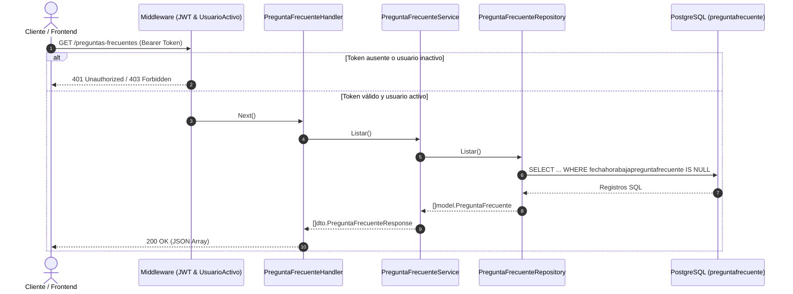

# Informe Técnico de Desarrollo y QA: Módulo de Preguntas Frecuentes

**Proyecto:** StemHub Backend  
**Historia de Usuario:** HU-AYS-B1 (Listado y Consulta de Preguntas Frecuentes)  
**Fecha:** 22 de Septiembre de 2026  
**Estado:** Finalizado y Validado  

---

## 1. Resumen Ejecutivo

El presente documento detalla las actividades de desarrollo, refactorización, integración arquitectónica y control de calidad (QA) realizadas para completar el módulo de **Preguntas Frecuentes** (`HU-AYS-B1`). 

El módulo permite al frontend y a clientes autenticados consultar el catálogo de preguntas frecuentes activas del sistema, así como acceder al detalle individual de una pregunta específica por su identificador único.

---

## 2. Diagnóstico Inicial y Resolución de Conflictos

Al iniciar el proceso de integración, se detectaron las siguientes discrepancias técnicas:

1. **Error de importación del módulo (`could not import ...`):**
   * *Causa:* En el archivo `internal/repository/pregunta_frecuente_repository.go` se importaba `github.com/Stemhub-Dev/Stem-Hub-BackEnd/internal/model`, mientras que el módulo raíz en `go.mod` está nombrado como `github.com/facu-1538/Stem-Hub-BackEnd`.
   * *Solución:* Se unificó la ruta de importación interna para concordar con el módulo y el resto del proyecto.
2. **Defecto en la iteración SQL:**
   * *Causa:* La validación `if err := rows.Err(); err != nil` se encontraba dentro del bucle `for rows.Next()`.
   * *Solución:* Se extrajo para evaluarse al finalizar la iteración de registros.
3. **Ausencia de cableado de dependencias y ruteo:**
   * Las capas del módulo no estaban instanciadas en `cmd/api/main.go` ni registradas en el motor HTTP en `internal/router/router.go`.
4. **Criterio 3 no implementado:**
   * No existía la capacidad de consultar una pregunta frecuente por ID (`GET /preguntas-frecuentes/:id`), necesaria para devolver `404 Not Found` en caso de no coincidencia.
5. **Discrepancia en etiquetas JSON del DTO:**
   * Las claves serializadas eran `pregunta` y `respuesta`, en lugar de `preguntaFrecuente` y `respuestaPreguntaFrecuente` estipuladas en los criterios de aceptación.

---

## 3. Arquitectura y Componentes Implementados

El flujo de control respeta el patrón por capas utilizado en la arquitectura de StemHub:



### Detalle de Archivos y Capas

### A. Modelo de Dominio
* **Archivo:** `internal/model/pregunta_frecuente.go`
* Mapea la tabla `preguntafrecuente` respetando tipos de datos (`BIGINT`, `VARCHAR(150)`, `TEXT` y `*time.Time` para el campo anulable de baja lógica).

### B. Contrato de Datos (DTO)
* **Archivo:** `internal/dto/pregunta_frecuente_dto.go`
* Serializa las claves en camelCase exacto requerido por el frontend:
  ```go
  type PreguntaFrecuenteResponse struct {
      ID                         int64  `json:"id"`
      FuncionalidadPrincipal     string `json:"funcionalidadPrincipal"`
      PreguntaFrecuente          string `json:"preguntaFrecuente"`
      RespuestaPreguntaFrecuente string `json:"respuestaPreguntaFrecuente"`
  }
  ```

### C. Repositorio (Persistencia)
* **Archivo:** `internal/repository/pregunta_frecuente_repository.go`
* Métodos:
  * `Listar() ([]model.PreguntaFrecuente, error)`: Recupera todas las preguntas con `fechahorabajapreguntafrecuente IS NULL` ordenadas por código. Inicializa un slice no-nil `make([]model.PreguntaFrecuente, 0)`.
  * `BuscarPorID(id int64) (*model.PreguntaFrecuente, error)`: Consulta por clave primaria activa. Retorna `sql.ErrNoRows` si el registro no existe o está dado de baja.

### D. Servicio (Lógica de Negocio)
* **Archivo:** `internal/service/pregunta_frecuente_service.go`
* Métodos:
  * `Listar() ([]dto.PreguntaFrecuenteResponse, error)`: Mapea entidades a DTOs.
  * `ObtenerPorID(id int64) (*dto.PreguntaFrecuenteResponse, error)`: Gestiona el error tipado `ErrPreguntaFrecuenteNoEncontrada`.

### E. Handler (Controlador HTTP)
* **Archivo:** `internal/handler/pregunta_frecuente_handler.go`
* Funciones:
  * `Listar(c *gin.Context)`: Responde con HTTP 200 y el array.
  * `ObtenerPorID(c *gin.Context)`: Valida que `:id` sea un entero positivo (HTTP 400 ante caracteres inválidos o números $\le 0$), maneja `ErrPreguntaFrecuenteNoEncontrada` (HTTP 404) y responde con HTTP 200 en éxito.

### F. Ruteo e Inyección de Dependencias
* **Archivos:** `internal/router/router.go` y `cmd/api/main.go`
* Las rutas quedaron protegidas bajo el grupo privado con validación JWT y verificación de usuario activo:
  * `GET /preguntas-frecuentes`
  * `GET /preguntas-frecuentes/:id`

---

## 4. Matriz de Cumplimiento de la Historia de Usuario (HU-AYS-B1)

| Requisito / Criterio | Especificación de la HU | Resultado Implementado | Estado |
| :--- | :--- | :--- | :---: |
| **Precondición** | Usuario autorizado | Protegido con `authMiddleware.ValidarJWT` y `authMiddleware.UsuarioActivo`. Retorna `401 Unauthorized` si no hay sesión activa. | **CUMPLIDO** |
| **Criterio 1** | Petición al endpoint devuelve HTTP 200 y array con: `id`, `preguntaFrecuente`, `respuestaPreguntaFrecuente`, `funcionalidadPrincipal` | `GET /preguntas-frecuentes` responde con `200 OK` y el payload con las propiedades requeridas. | **CUMPLIDO** |
| **Criterio 2** | Sin preguntas cargadas responde HTTP 200 y array vacío `[]` | Repository y Service inicializan slices con longitud 0 (`make(..., 0)`), serializando `[]` en JSON en lugar de `null`. | **CUMPLIDO** |
| **Criterio 3** | ID inexistente responde con HTTP 404 | `GET /preguntas-frecuentes/:id` devuelve `404 Not Found` con mensaje `{"error": "pregunta frecuente no encontrada"}`. | **CUMPLIDO** |

---

## 5. Matriz de Casos de Prueba (QA y Casos Orilla)

| Caso # | Tipo de Prueba | Petición HTTP | Condiciones de Prueba | HTTP | Payload Esperado |
| :---: | :--- | :--- | :--- | :---: | :--- |
| **QA-01** | Borde: Sin Auth | `GET /preguntas-frecuentes` | Sin cabecera `Authorization` | `401` | `{"error": "cabecera de autorización requerida"}` |
| **QA-02** | Borde: Token inválido | `GET /preguntas-frecuentes` | `Authorization: Bearer token_erroneo` | `401` | `{"error": "token inválido o expirado"}` |
| **QA-03** | Límite: BD Vacía | `GET /preguntas-frecuentes` | Tabla `preguntafrecuente` sin filas | `200` | `[]` |
| **QA-04** | Normal: Listado | `GET /preguntas-frecuentes` | Preguntas activas en la BD | `200` | Array de objetos completos |
| **QA-05** | Normal: Consulta ID | `GET /preguntas-frecuentes/1` | ID 1 activo | `200` | Objeto individual de pregunta |
| **QA-06** | Borde: ID Inexistente | `GET /preguntas-frecuentes/999999` | ID no registrado | `404` | `{"error": "pregunta frecuente no encontrada"}` |
| **QA-07** | Borde: Soft-Delete | `GET /preguntas-frecuentes/5` | ID con `fechahorabaja IS NOT NULL` | `404` | `{"error": "pregunta frecuente no encontrada"}` |
| **QA-08** | Borde: ID Alfanumérico | `GET /preguntas-frecuentes/xyz` | Letras en lugar de entero | `400` | `{"error": "id de pregunta frecuente inválido"}` |
| **QA-09** | Borde: ID Negativo/Cero | `GET /preguntas-frecuentes/0` | Entero menor o igual a cero | `400` | `{"error": "id de pregunta frecuente inválido"}` |
| **QA-10** | Borde: ID Decimal/Overflow | `GET /preguntas-frecuentes/2.5` | Formato flotante o desborde | `400` | `{"error": "id de pregunta frecuente inválido"}` |

---

## 6. Verificación y Compilación

* **Compilación de paquetes:**  
  Se ejecutó `go build ./...` sobre la raíz del repositorio, finalizando con **código de salida 0 (cero errores y cero advertencias)**.
* **Integridad del código:**  
  Se respetaron las convenciones idiomáticas de Go (`fmt`, `errors.Is`, manejo de errores explícito y defer para cierre de cursores de BD).
